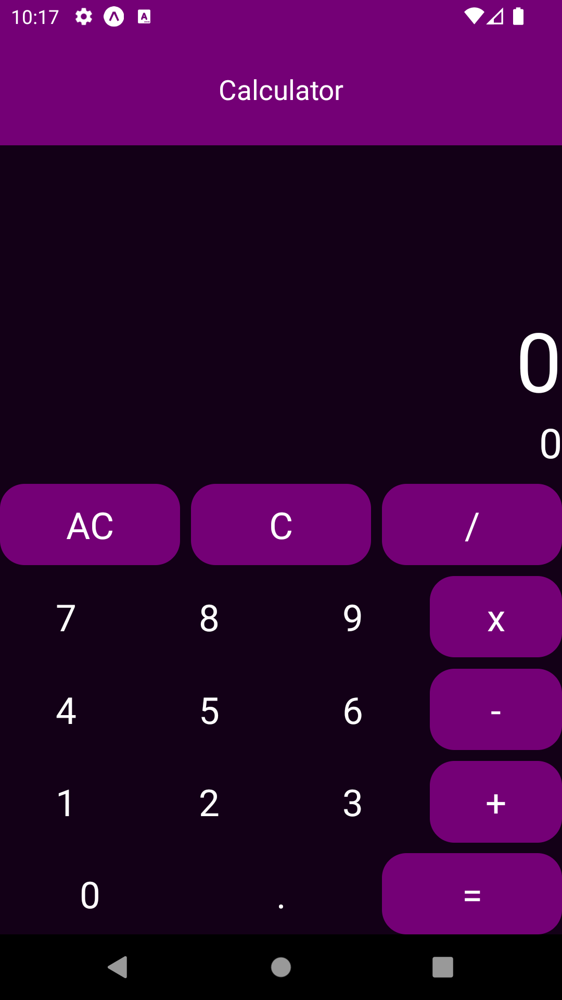

# Piscine Mobile - 0: The Basics of Mobile Development

This is the repository for Module00 of the Piscine Mobile, which is an intensive bootcamp on mobile development. This module covers the basics of mobile development, to create simple mobile applications.

## Table of Contents

Exercise 00: A Basic Display
Exercise 01: Say Hello to the World
Exercise 02: Moar Buttons
Submission and Peer-evaluation

### Introduction

This module starts with an introduction to mobile applications and Flutter. Mobile applications are software applications designed to run on mobile devices, such as phones and tablets. Flutter is a mobile UI framework for crafting high-quality native interfaces on iOS and Android in record time. It works with existing code, is used by developers and organizations around the world, and is free and open source.
In this project you have the choice to chose what framework you will use. **(For me I use REACT-NATIVE)**

### Exercise 00: A Basic Display

In this exercise, you will create a new project using the tools provided by the framework of your choice. If you use Flutter, you will create a single page with a text and a button, both centered horizontally and vertically. When the button is clicked, "Button pressed" will be displayed in the debug console. Your application must also be responsive.

### Exercise 01: Say Hello to the World

In this exercise, you will modify the previous project to display "Hello World!" instead of the initial text when the button is clicked. Each time the button is clicked, the text should switch between the initial text and "Hello World!".

### Exercise 02: Moar Buttons

In this exercise, you will create a new project called "calculator_proj" and display an AppBar at the top of the screen with the title "Calculator". You will also display two text fields (one for displaying the expression and one for displaying the result) and several buttons. You must add debug to display the text of each button in the debug console when pressed. Once all the buttons have been properly set, you will make sure the display is suitable for all devices.

  

